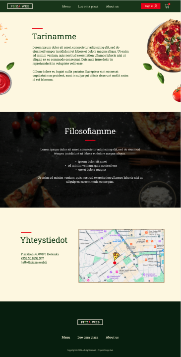
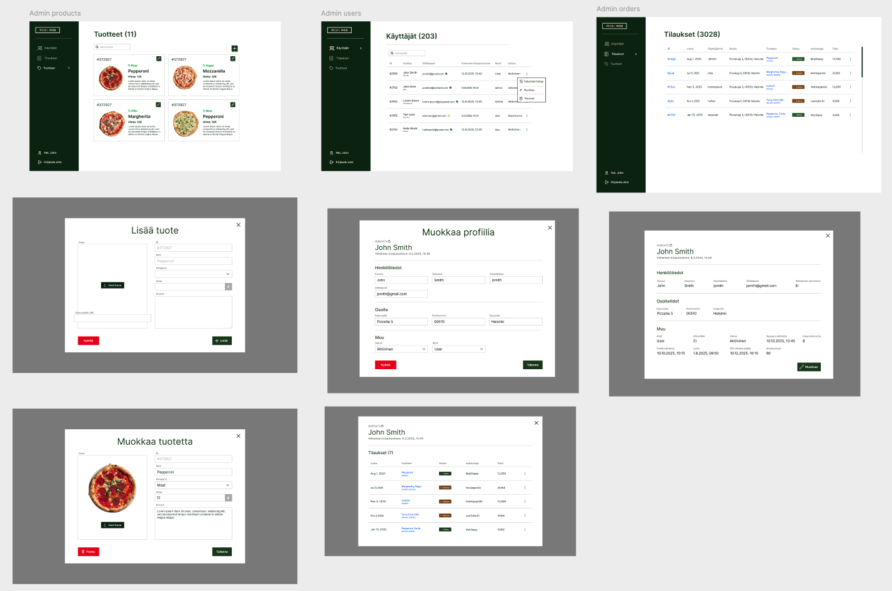
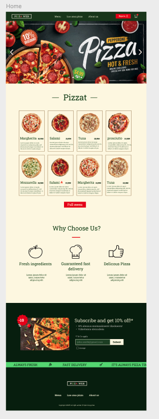
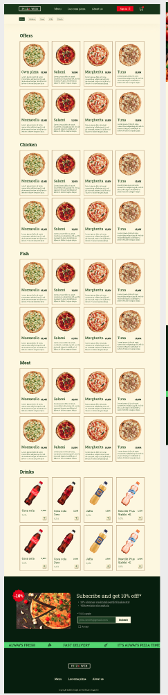
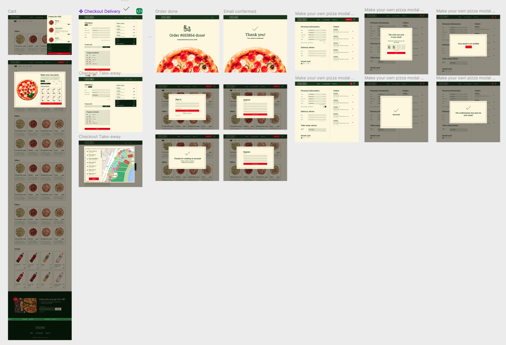

# Pizzaweb

Pizzawebissä käyttäjät voi tilata pizzoja kotiinkuljetuksena tai myymälänoutona. Käyttäjät voivat myös luoda omia pizzoja valitsemalla omat ainekset, pizzapohjan ja koon. Kohderyhmänä ovat kaikki, jotka arvostavat laatua ja aitoa italialaista makua.

## Miksi Pizzaweb

Pizzaweb tekee laadukkaiden pizzojen tilauksesta helppoa.

## asennusohjeet

1. Avaa @server ja tee `npm i`
2. Lisää `.env.local` tiedosto
3. node server
4. cd @media
5. `npm i`
6. `npm run dev`

Admin:

1. @server, node server
2. `git checkout admin-page`
3. `npm run dev`

# Toiminnallisuudet ja käyttö

## Ostajat

### Pizzojen selaaminen

Käyttäjä voi selata pizzoja /menu sivulta jossa näkyy koko sivun valikoima. Valikoimasta voi suodattaa valikoimaa kategorian mukaan. Tarjolla on myös juomia.

### Ostoskori

Käyttäjä voi lisätä tuotteita ostoskoriin painamalla tuotekortin alareunassa painiketta "Lisää koriin", joka lisää kyseisen pizzan koriin. Lisätyt tuotteet löytyvät ylävalikon ostoskoripainikkeesta avautuvasta sivuvalikosta.

### Oman pizzan luonti

Käyttäjä voi luoda omia pizzoja. Sivun ylävalikossa on painike "Luo oma pizza", joka avaa ponnahdusikkunan. Ikkunasta käyttäjä voi valita pizzan koon, pohjan ja lisätä lisukkeita. Kun käyttäjä on valmis voi oman pizzan lisätä ostoskoriin.

### Tilaaminen

Tilausta varten käyttäjällä tulee olla lisättynä ostoskoriin vähintään yksi tuote. Kassalle pääsee ostoskorinäkymän "siirry kassalle"-painikkeesta. Kassalla sivun yläpuolella voi valita haluaako tilauksen kotiinkuljetuksen vai noutona. Toimituksena käyttäjä syöttää yhteystietonsa. Noutoa varten käyttäjä syöttää vain nimen, noutopaikan osoitteen ja puhelinnumeron. Lopuksi käyttäjä syöttää mahdollisen alennuskoodin ja valitsee maksutavan. Tietojen syötettyään käyttäjä voi vahvistaa tilauksen painamalla "Tee tilaus". Lopuksi ilmestyy tilauksen vahvistuksen sivu ja mahdollinen toimitusaika.

### Käyttäjätietojen muokkaaminen

Käyttäjä voi löytää kaikki omat tietonsa painamalla punaista painiketta ylävalikossa, jossa lukee käyttäjän nimi. Avautuu uusi sivu, jossa käyttäjän yhteystiedot, osoite ja tehdyt tilaukset. Käyttäjä voi ottaa käyttöön vahvan tunnistautumisen painikkeesta.

### Alennuskupongin käyttäminen

Käyttäjä voi syöttää alennuskupongit kassalla. Kun koodi on lisätty päivittyy uusi hinta.

### Uutiskirje ja alennuskuponki

Käyttäjä voi liittyä uutiskirjeeseen sivun alhaalta olevasta osiosta. Käyttäjä syöttää sähköpostinsa ja saa sähköpostissa alennuskoodin.

### Pizzerioiden selaaminen

"Meistä"-sivun lopussa on yhteystiedot ja vieressä kartta, jossa kaikki toimipisteet.

## Admin

Verkkosivun hallitsijat voivat lisätä tuotteita, muokata tuotteiden tietoja, muokata rekisteröityneiden käyttäjien tietoja, muokata omia tietoja sekä lisätä ja muokata alennuskuponkeja. Adminit voivat vaihtaa sivuja sivuvalikosta.

### Tuotteiden lisääminen

Admin käyttäjät voi lisätä tuotteita "Tuotteet"-välilehdeltä. Tuotteita voi lisätä sivun yläkulmassa olevasta "+"-painikkeesta, joka avaa ponnahdusikkunan. Ikkunasta käyttäjä voi lisätä tuotteen kuva, nimen, hinnan, kategorian ja kuvauksen. Kun käyttäjä on valmis voi tuotteen lisätä "+ Lisää"-painikkeesta

### Tuotteiden muokkaaminen

Olemassaolevan tuotteen tietoja voi muokata painamalla "tuotteet"-sivulta tuotekortin yläkulmassa olevaa kynäpainiketta. Ponnahdusikkunasta voi muuttaa tuotteen tietoja ja tallentaa ne "Tallenna"-painikkeesta.

### Käyttäjätietojen selaus ja muokkaus

Sivun rekisteröityneiden käyttäjien tiedot löytyvät välilehdeltä "Käyttäjät". Sivulla voi hakea listasta käyttäjien tietoja hakukentän avulla nimen tai ID:n perusteella. Käyttäjärivin lopusta kolmen pisteen painikkeesta avautuu ikkuna josta voi valita haluaako tarkastella käyttäjän tietoja, muokata tietoja vai nähdä kyseisen käyttäjän tekemät tilaukset.

### Alennuskuponkien lisääminen

Alennuskupongit löytyvät omasta välilehdestä. Sivu näyttää voimassaolevat kupongit. Yläkulmassa olevasta painikkeesta avautuu ponnahdusikkuna johon voi syöttää uuden kupongin tiedot. Kun tiedot on lisätty tallentuu muutokset lisää painikkeesta.

### Admin käyttäjätietojen muokkaus

Adminit voivat tarkastella omia tietoja ja muokata niitä sivuvalikosta painamalla oman nimen linkkiä. Linkistä avautuu ponnahdusikkuna. Ikkunasta voi vain tarkastella tietoja tai muokata painamalla alakulmasta "Muokkaa"-painiketta. Tiedot tallennetaan "Tallenna"-painikkeesta

### Tilauksien selaus ja statuksen muokkaus

Kaikki käyttäjien tekemät tilaukset löytyvät tilaukset-sivulta. Kaikki tilaukset on listattu uusimmasta vanhimpaan. Tilauksen statusta voi vaihtaa painamalla statuskuvaketta, joka avaa pudotusvalikon. Kun uusi status on valittu, päivittyy se suoraan tilaukselle.

# Design mockups

